# Federated Optimization and Privacy-Preserving Distributed Learning

Below are the final results for torch.manual_seed(42), np.random.seed(42). In order to reproduce the same results, in Google Colab select Runtime --> Change runtime type --> A100 GPU --> Save and run all cells.

## Reducing Communication Cost via Different Communication Rounds ($\tau$)

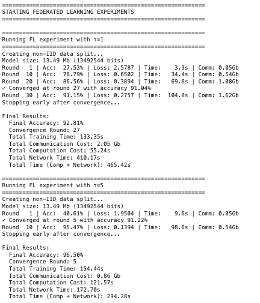
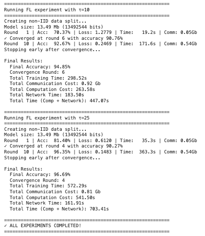
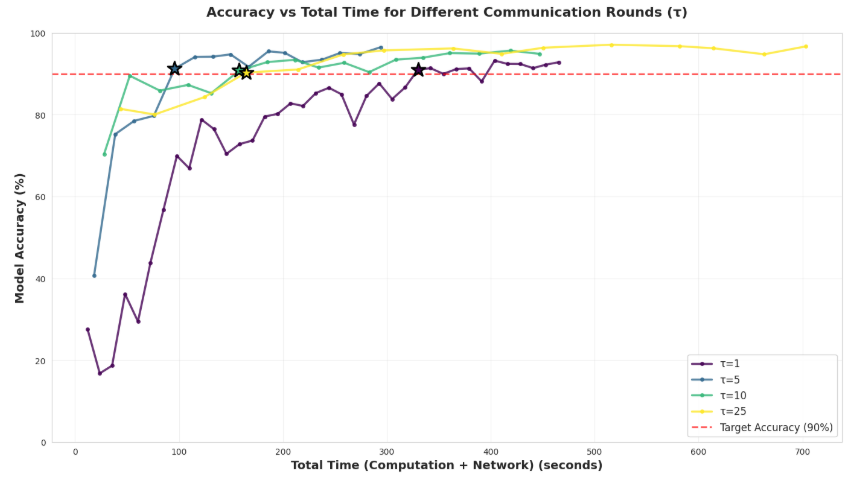
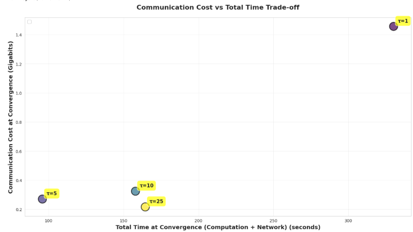
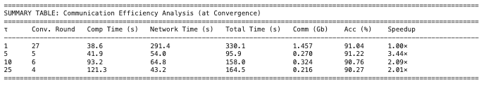

## Reducing Communication Cost via Compression

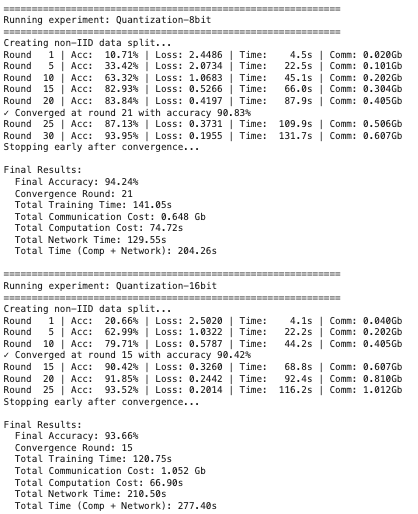
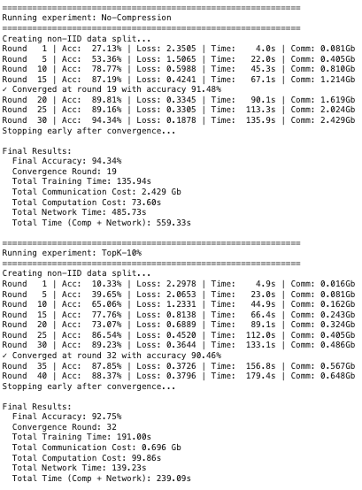
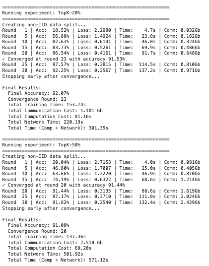
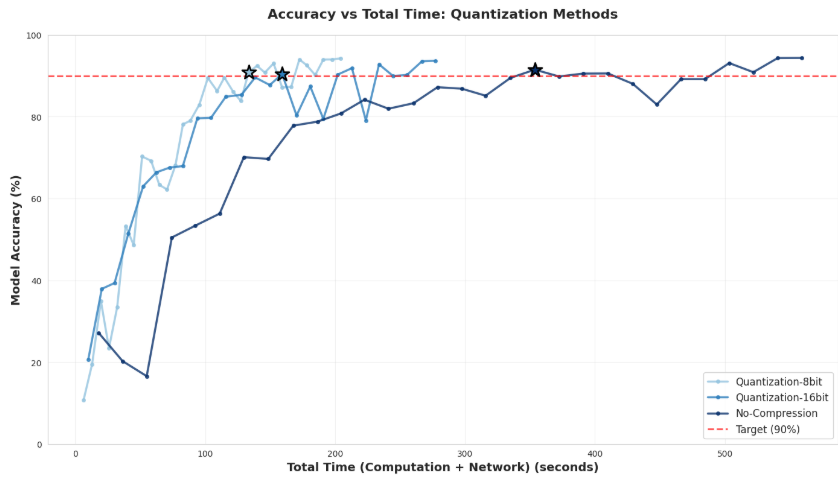
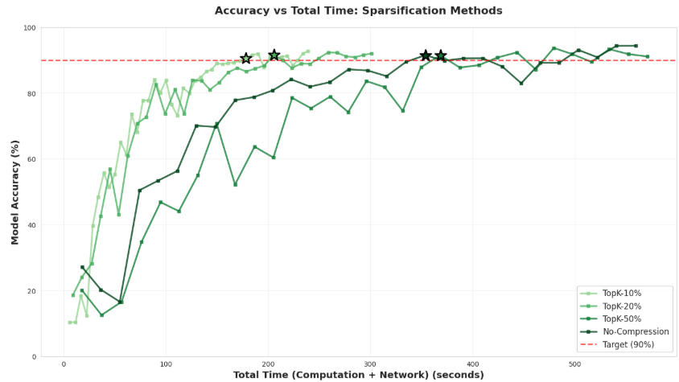
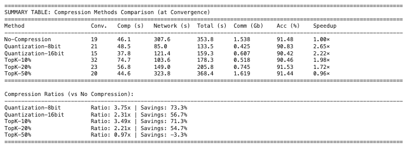

## Reducing Communication cost via Selecting Fewer Workers

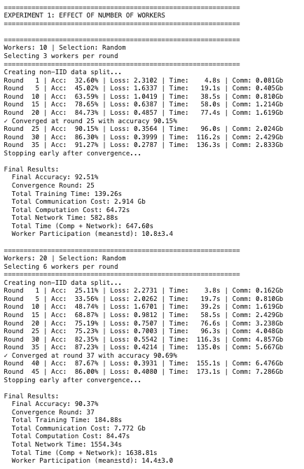
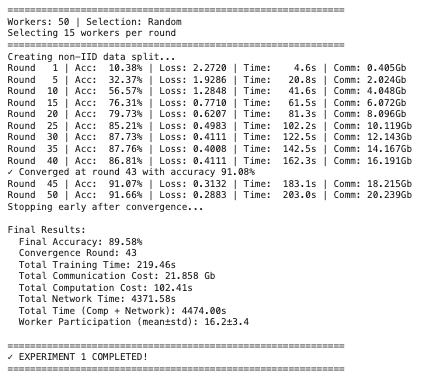
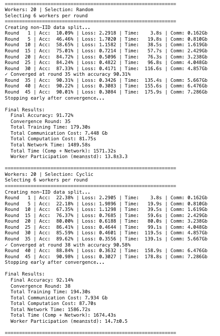
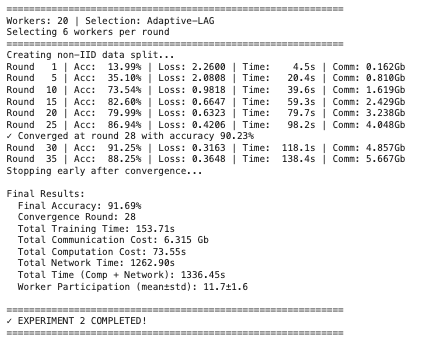
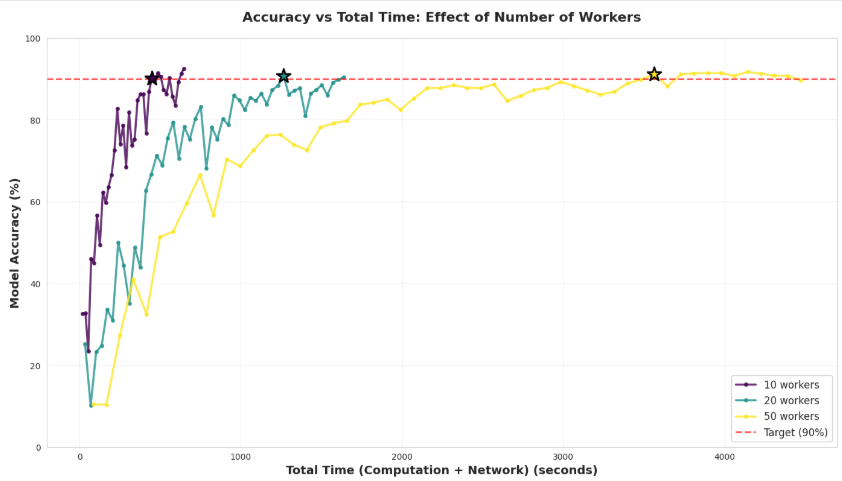
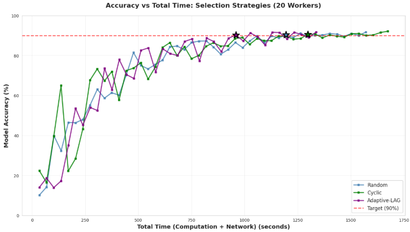
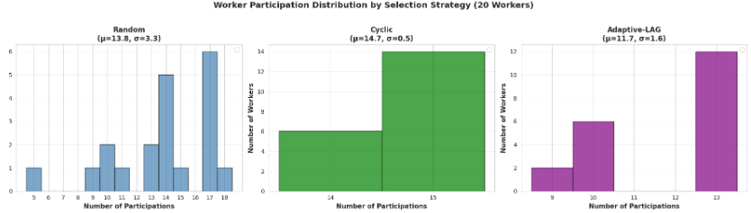
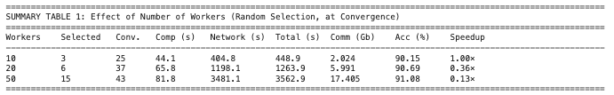
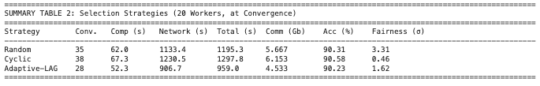
